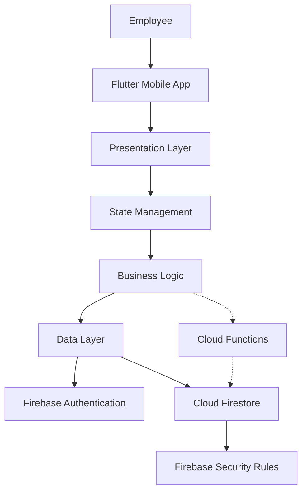

# RentMate
## Technical Requirements Document (TRD)

| Document Detail | Information |
|---|---|
| Product Name | RentMate |
| Document | Technical Requirements Document |
| Version | 1.0 |
| Status | Draft — Pending Approval |
| Frontend | Flutter |
| Language | Dart |
| Backend Services | Firebase |
| Database | Cloud Firestore |
| Authentication | Firebase Authentication |
| Platform | Android |

---

## 1. Introduction

This document describes the technical architecture, technology stack, database design, application modules, security requirements and testing strategy for RentMate.

RentMate is a Flutter-based mobile application that uses Firebase services to manage event equipment, bookings, availability, dispatches and returns.

## 2. Technology Stack

| Technology | Purpose |
|---|---|
| Flutter | Mobile user interface |
| Dart | Application programming language |
| Firebase Authentication | Employee login and identity |
| Cloud Firestore | Cloud database for bookings and inventory |
| Firebase Security Rules | Database authorization |
| Cloud Functions (if required) | Trusted server-side booking operations |
| Git | Version control |
| GitHub | Repository and pull request management |
| Android Studio | Android SDK and emulator |
| VS Code / Antigravity IDE | Application development |

Firebase Storage can be introduced if equipment images are required.

## 3. System Architecture

RentMate will use a modular Flutter architecture with a separation between presentation, business logic and data access.

### 3.1 Architecture Layers

**Presentation Layer**
- Flutter screens.
- Reusable widgets.
- Forms and input validation.
- Navigation and state presentation.

**State Management Layer**
- Maintains UI state.
- Manages loading, success and error states.
- Connects screens with application services.

**Business Logic Layer**
- Booking validation.
- Equipment availability calculations.
- Booking status transitions.
- Dispatch and return validation.

**Data Layer**
- Firebase Authentication service.
- Firestore repositories.
- Booking and inventory data access.
- Error handling.

**Firebase Services**
- Authentication.
- Cloud Firestore.
- Security Rules.
- Optional Cloud Functions.

### 3.2 High-level Architecture



The diagram represents the proposed architecture. Cloud Functions are optional and may be used for trusted booking operations.

## 4. Application Modules

### 4.1 Authentication Module

Responsibilities:
- Employee login.
- Session management.
- Logout.
- Role-aware navigation.

Technology: Firebase Authentication.

### 4.2 Dashboard Module

Responsibilities:
- Display operational summaries.
- Display upcoming bookings.
- Show pending dispatches and returns.
- Provide navigation to application modules.

Technology: Flutter and Firestore queries.

### 4.3 Equipment Module

Responsibilities:
- Create and edit equipment records.
- Retrieve equipment inventory.
- Display equipment categories and quantities.
- Track equipment condition.

Technology: Cloud Firestore.

### 4.4 Booking Module

Responsibilities:
- Create event bookings.
- Update booking information.
- Cancel authorized bookings.
- Retrieve booking details.
- Track booking status.

Technology: Flutter, Dart and Cloud Firestore.

### 4.5 Availability Module

Responsibilities:
- Check equipment quantities.
- Evaluate overlapping rental periods.
- Calculate available stock.
- Reject unavailable requests.
- Revalidate inventory during confirmation.

Technology: Dart business logic and a trusted atomic reservation operation.

### 4.6 Dispatch Module

Responsibilities:
- Display scheduled dispatches.
- Retrieve booking equipment details.
- Record dispatch quantities.
- Update dispatch status.

Technology: Cloud Firestore.

### 4.7 Returns Module

Responsibilities:
- Retrieve pending returns.
- Record returned quantities.
- Record damaged or missing items.
- Update inventory after verified returns.

Technology: Cloud Firestore.

## 5. Firestore Database Design

Firestore is a NoSQL document database. RentMate will use collections and documents to store its data.

### 5.1 users Collection

Path: users/{userId}

| Field | Type | Description |
|---|---|---|
| name | String | Employee name |
| email | String | Employee email |
| role | String | Assigned role |
| active | Boolean | Account status |
| createdAt | Timestamp | Account creation time |

### 5.2 equipment Collection

Path: equipment/{equipmentId}

| Field | Type | Description |
|---|---|---|
| name | String | Equipment name |
| sku | String | Stock keeping unit identifier |
| category | String | Equipment category |
| totalQuantity | Integer | Physical inventory quantity |
| rentableQuantity | Integer | Available rentable stock |
| condition | String | Equipment condition |
| active | Boolean | Whether equipment is active |
| createdAt | Timestamp | Record creation time |
| updatedAt | Timestamp | Last update time |

### 5.3 bookings Collection

Path: bookings/{bookingId}

| Field | Type | Description |
|---|---|---|
| eventName | String | Event name |
| customerName | String | Customer name |
| phoneNumber | String | Customer contact number |
| venue | String | Event location / venue |
| eventType | String | Event category (Wedding, Corporate, etc.) |
| startAt | Timestamp | Rental start datetime |
| endAt | Timestamp | Rental end datetime |
| status | String | Booking status (`draft`, `confirmed`, `dispatched`, `partially_returned`, `returned`, `cancelled`) |
| estimatedTotal | Number | Estimated rental cost |
| items | Array | Array of `{equipmentId, quantity, unitPrice}` |
| createdBy | String | Employee user ID |
| createdAt | Timestamp | Booking creation time |
| updatedAt | Timestamp | Last modification time |

Example booking document:

```json
{
  "eventName": "Wedding Reception",
  "customerName": "Rahul Sharma",
  "phoneNumber": "+91 98765 43210",
  "venue": "Grand Palace Hall",
  "eventType": "Wedding",
  "startAt": "Firestore Timestamp",
  "endAt": "Firestore Timestamp",
  "status": "confirmed",
  "estimatedTotal": 15000,
  "createdBy": "employee_001",
  "items": [
    {
      "equipmentId": "speaker_001",
      "quantity": 12,
      "unitPrice": 500
    }
  ]
}
```

The timestamp values above are illustrative placeholders; the actual database should store Firestore Timestamp values.

### 5.4 dispatches Collection

Path: dispatches/{dispatchId}

| Field | Type | Description |
|---|---|---|
| bookingId | String | Associated booking ID |
| scheduledAt | Timestamp | Planned dispatch time |
| status | String | Dispatch status |
| items | Array | Equipment and dispatched quantities |
| dispatchedAt | Timestamp / Null | Actual dispatch time |
| recordedBy | String | Employee ID |

### 5.5 returns Collection

Path: returns/{returnId}

| Field | Type | Description |
|---|---|---|
| bookingId | String | Associated booking |
| dispatchId | String | Associated dispatch |
| returnedAt | Timestamp | Actual return time |
| items | Array | Returned quantities and conditions |
| recordedBy | String | Employee ID |

Each return item should identify its equipment and include the returned quantity and condition.

## 6. Booking Availability Algorithm

The system must check availability for every requested equipment type over the complete rental period.

### Step 1: Validate Input
- Validate rental start and end dates.
- Validate positive quantities.
- Validate equipment identifiers.

### Step 2: Determine Relevant Reservations
Retrieve active reservations that overlap the requested rental period. Cancelled reservations must be excluded.

### Step 3: Calculate Availability
For each equipment type:
- Start with the rentable inventory.
- Consider reservations active during each part of the requested period.
- Calculate the maximum simultaneous reserved quantity.
- Subtract it from the rentable inventory.

### Step 4: Validate the Request
Compare the requested quantity with the calculated available quantity.

### Step 5: Confirm the Booking
Revalidate and reserve the inventory atomically. Do not rely on a previous client-side availability check alone.

### Date Convention

The implementation should agree on a consistent rental interval. A proposed convention is a half-open interval: the rental start is inclusive and the return date is exclusive. This permits equipment to be rented again on its verified return date, subject to the actual operational rules.

## 7. Preventing Double Bookings

Concurrent booking requests can cause over-reservation if availability checking and booking creation are separate operations.

The booking confirmation process must therefore:
1. Validate the requested equipment and dates.
2. Check inventory within a trusted atomic operation.
3. Create the reservation only if sufficient stock is available.
4. Reject the transaction if another request has already consumed the available stock.
5. Return a clear conflict message to the employee.

A Firestore transaction can be used with an appropriate inventory reservation design. For more complex booking logic, a callable Cloud Function can perform the trusted operation.

The final implementation must be tested with concurrent requests.

## 8. Authentication and Authorization

- Use Firebase Authentication for employee identities.
- Assign employee roles through a trusted administrative process.
- Use Firestore Security Rules to protect database operations.
- Do not rely on hiding UI elements as the only security measure.
- Validate privileged operations on a trusted backend.
- Restrict employee access according to the agreed role permissions.

## 9. Proposed Flutter Folder Structure

```text
lib/
├── main.dart
├── app.dart
├── core/
│   ├── constants/
│   ├── theme/
│   └── utils/
├── models/
├── services/
│   ├── auth_service.dart
│   ├── equipment_service.dart
│   ├── booking_service.dart
│   ├── dispatch_service.dart
│   └── return_service.dart
├── features/
│   ├── auth/
│   ├── dashboard/
│   ├── equipment/
│   ├── bookings/
│   ├── dispatch/
│   └── returns/
└── widgets/
```

This is a proposed structure and can be adjusted as the project grows.

## 10. State Management

The application requires state management for:
- Authentication state.
- Dashboard data.
- Equipment lists.
- Booking forms and availability results.
- Dispatch and return status.
- Loading and error states.

Provider is a proposed option for state management. The final package should be agreed upon by the team before implementation.

## 11. Error Handling

The application must handle:
- Authentication errors.
- Firestore permission errors.
- Network interruptions.
- Invalid booking dates.
- Insufficient equipment quantities.
- Concurrent reservation conflicts.
- Invalid status transitions.
- Failed dispatch and return updates.

The UI should show clear messages and avoid reporting failed operations as successful.

## 12. Security Requirements

- Restrict access to authenticated employees.
- Validate employee roles.
- Protect administrative operations.
- Prevent unauthorized inventory changes.
- Protect booking and customer data.
- Validate data before writing to Firestore.
- Use restrictive Firestore Security Rules.
- Avoid storing secret credentials in the Flutter application.

## 13. Testing Strategy

### Unit Testing
- Date overlap calculations.
- Availability calculations.
- Quantity validation.
- Booking status transitions.
- Return quantity validation.

### Widget Testing
- Login form.
- Equipment selection.
- Booking form.
- Availability result display.
- Dispatch and return forms.

### Integration Testing
- Employee login.
- Equipment creation and retrieval.
- Booking creation.
- Booking cancellation.
- Dispatch recording.
- Return recording.

### Security Testing
- Unauthenticated access.
- Unauthorized database writes.
- Role-based access.
- Concurrent booking attempts.

## 14. Deployment Strategy

- Configure the Firebase development project.
- Run the application on an Android emulator.
- Test on a physical Android device.
- Build a debug APK for development testing.
- Prepare a release APK or app bundle for the final demonstration.
- Keep production configuration and access restricted.

## 15. Technical Decisions Pending

- Final state management package.
- Reservation transaction design.
- Whether Cloud Functions are necessary.
- Final Firebase Security Rules.
- Supported Android versions.
- Exact rental date and return conventions.
- Treatment of damaged and partially returned inventory.

---

**Document Status:** Draft — Pending Mentor Approval